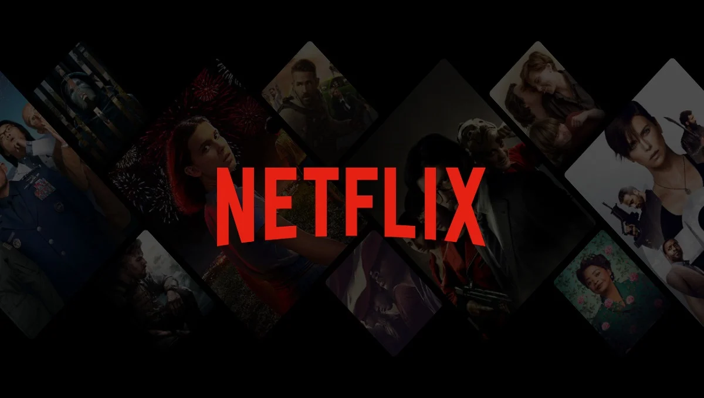

# Netflix Clone Project

()

## Overview

Welcome to the Netflix Clone Project! This repository is dedicated to creating a Netflix clone in multiple stages, each adding new functionalities and technologies. Our goal is to progressively build a full-fledged MERN (MongoDB, Express.js, React.js, Node.js) stack implementation.

### Stages

1. **V1 - HTML and CSS Only:**
   - Basic static web pages resembling the Netflix interface.
   - Responsive design for various screen sizes.

2. **V2 - HTML, CSS, and JavaScript:**
   - Enhanced user interaction with dynamic content using JavaScript.
   - Implementation of features like carousel, modal pop-ups, etc.

3. **V3 - MERN Fullstack:**
   - Integration with MongoDB for data storage.
   - Building a Node.js and Express.js backend to handle API requests.
   - Developing a React.js frontend for a dynamic user interface.
   - Fullstack application with user authentication, movie recommendations, and more.

## Project Structure

Thi project is organized into different directories representing each stage of development:

- `/v1`: HTML and CSS-only version.
- `/v2`: HTML, CSS, and JavaScript version.
- `/v3`: MERN Fullstack implementation.
## Setup Instructions

To run each version of the project, follow the step-by-step instructions provided in the respective README files of each version.

## Technologies Used

Key technologies and frameworks used in this project include:

- HTML5
- CSS3
- JavaScript
- React.js
- Node.js
- Express.js
- MongoDB

